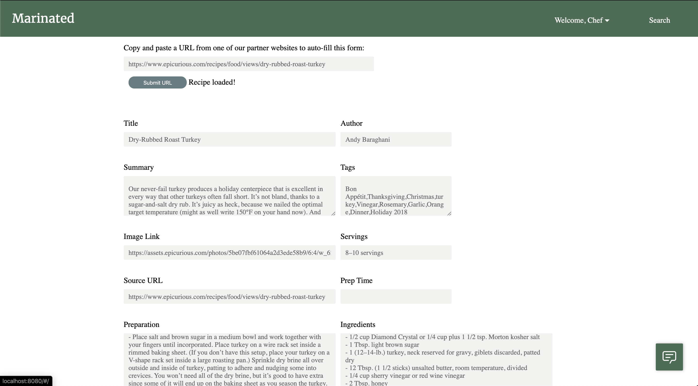
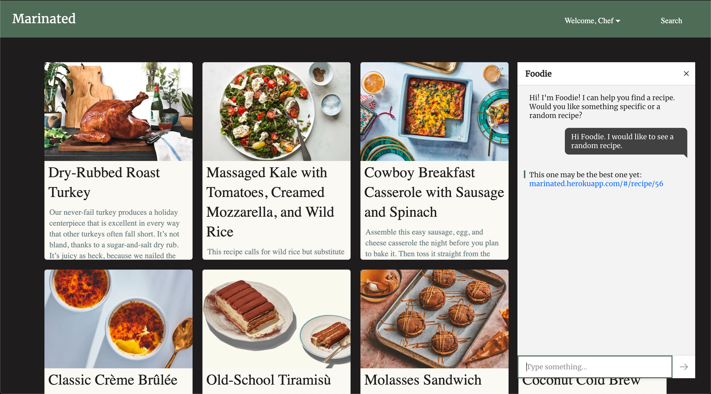
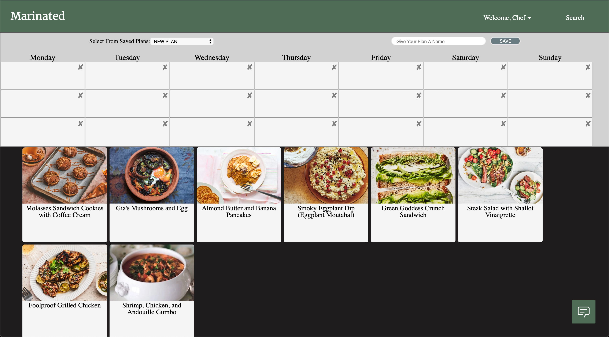
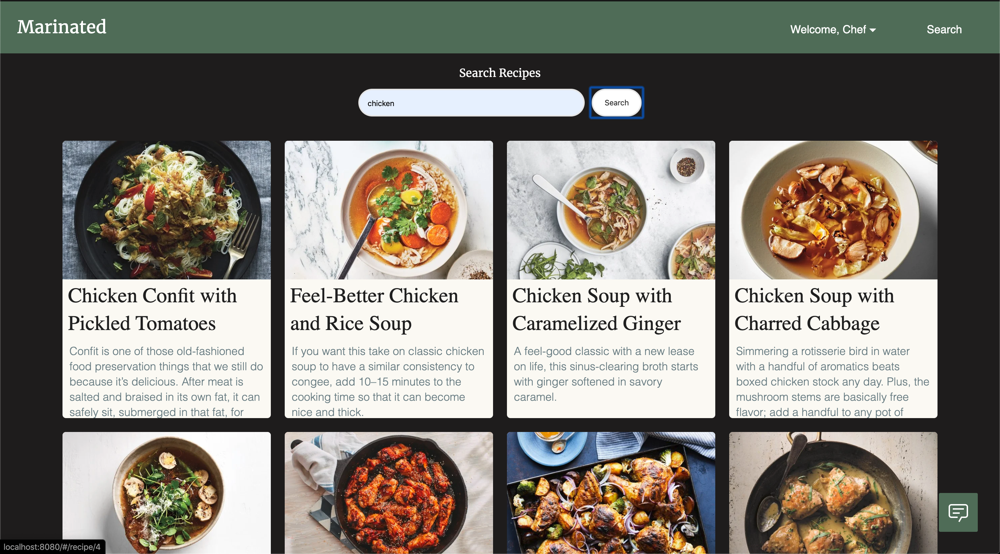

# Marinated

Created By:
[Lloyd Gerry](https://github.com/lloydgerry) & 
[Graeme Nickerson](https://github.com/graemenickerson)

## Description

Marinated is an online recipe hub to save, import and plan your meals. Browse through our database of recipes and save them for future reference. If you need help finding something good you can use the search function or interact with our very own AI Foodie, a helpful bot who is here to help you find great things to eat. If what you are looking for is not avaiable in the database you can input recipes either by manually entering them or by providing the url to the recipe you want to add. Once you have created a catalog of recipes you like, you are able to add them to a meal plan through our drag and drop mealplan builder. Marinated is your one stop online shop for your recipe needs.

See a working demo version here: https://marinated.herokuapp.com/

Home Page View


New Recipe Page View


Chat Bot


Meal PLan Page View


Search Results


---
---
## Getting Started

1. Create the `.env` by using `.env.example` as a reference
2. Update the .env file with your correct local information
3. Install dependencies: `npm i`
4. Run the front end server using `npm run serve`
5. Run the server: `npm run local`
    - Note: nodemon is used, so you should not have to restart your server
6. Visit `http://localhost:8080/`

## Project setup
```
npm install
```

#### Compiles and hot-reloads for development
```
npm run serve
```

#### Compiles and minifies for production
```
npm run build
```

#### Run the backend server using nodemon
```
npm run local
```

## Dependencies

    axios 0.19.0
    body-parser 1.19.0
    cheerio 1.0.0-rc.3
    cookie-session 1.3.3
    core-js 3.3.2
    dotenv 8.2.0
    express 4.17.1
    pg 7.14.0
    pg-native 3.0.0
    psql 0.0.1
    puppeteer 2.0.0
    vue 2.6.10
    vue-router 3.1.3
    vue-smooth-dnd 0.8.1
    vuex 3.0.1